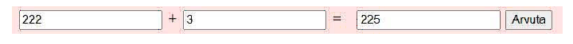
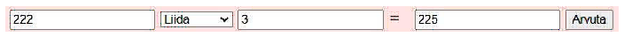
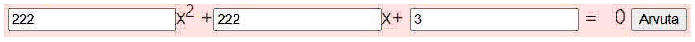

1.  Lihtne liitmine – teha vorm kus on kolm lahtrit: väärtus1, väärtust2 ja tulemuse lahter. Lisaks on nupp, millel vajutades liidetakse lahtritest väärtus1 ja 2 asjad ja pannakse lahtrisse tulemus

2. Sama nagu punkt 1 aga nüüd teostame korrutamise

3. Sama nagu punkt 1 aga nüüd teostame jagamis. PS! 0-ga oskab jagada ainult Chuck Norris, seega proovi nii, et JS katki ei lähe

4. Reaalne kalkulaator: Kasutajale kuvatakse väärtust1, siis valikmenüü tehetega (Liitmine, lahutamine, korrutamine ja jagamine), siis lahter teise väärtusega ning kolmas lahter kuhu tulemus kirjutatakse ning lõpuks nupp, mis teostab vastava tehte.

5. Ruutvõrrandi lahendamine. https://www.taskutark.ee/harjuta/ruutvorrand-ja-selle-lahendamine/

Tulemuseks kuvada mõlemad X vääärtused

6. Lugeda ära palju on tekstis mingit tähte. Kasutajal on kaks lahtrit, ühte sisestab teksti ja teise tähe. Tulemuseks kirjutatakse mitu vastavat tähte esines antud tekstis

7. Lugeda ära mitu sõna on tekstis. Kasutaja saab sisestada mitmerealise tekstis (textarea) ja süsteem kuvab kasutajale mitu sõna oli. Sõnaks loetakse kõik kus enne tühikut on pikem tekst kui kahe-täheline. „Tere ja mina“ on 2 sõna. „kuidas sul küll läheb“ on 4 sõna. „ei ja ja on sidesõnad“ on 1 sõna.

8. Kuupäeva validaator. Süsteemi sisestatakse kuupäev, mis peab olema formaadis pp.kk.aaaa (näiteks 14.01.2021). Süsteem kontrollib kas antud tekst on kuupäev ilma teksti kuupäevaks konverteerimata (ehk et teeme manuaalse kontrolli vastavalt kas pp on lubatud vahemikus, kas kk on lubatud vahemikus, kas antud kuus on nii palju päevi jne Liigaastaga ei pea arvestama).
